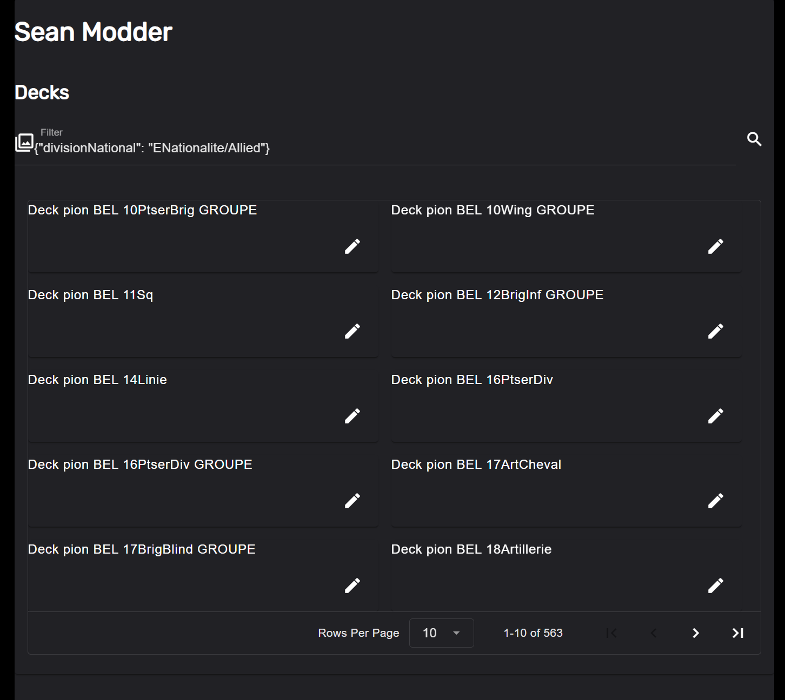
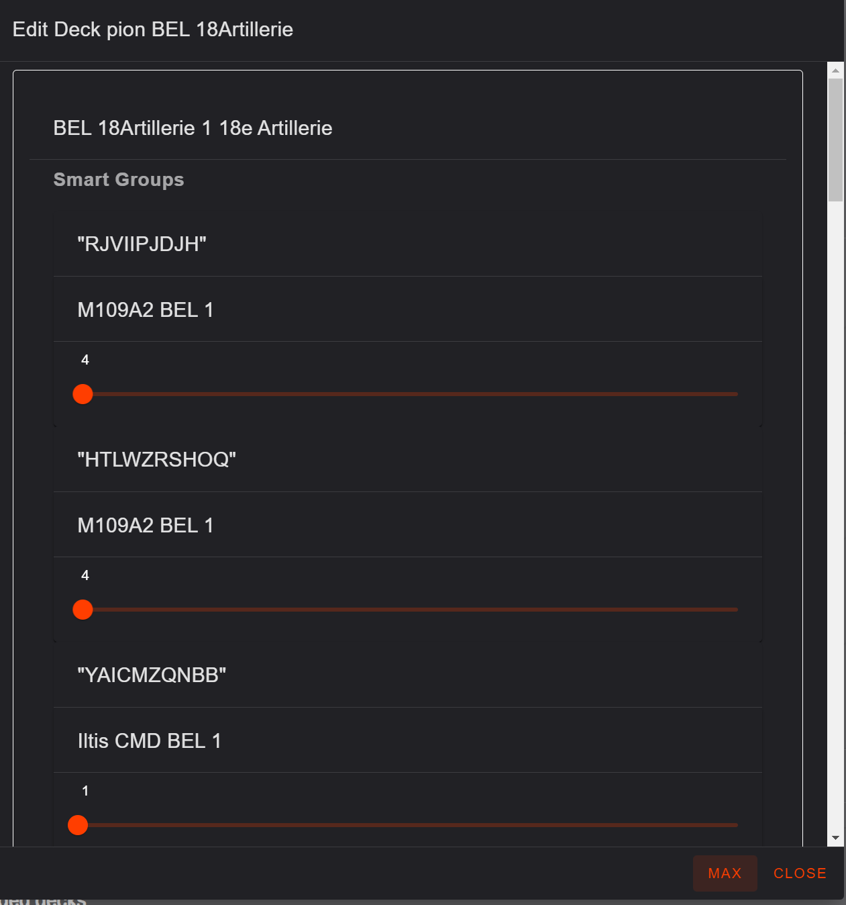

# A Warno Moder maker

You want to bulk edit the Decks number of units per card, then this is the tool for you

> Based on : https://github.com/Ulibos/ndf-parse

## Requirements

- Docker desktop
- Python
- Node
- A donor mod from Warno
- Put these files alongside the mods in Warno

## Setup

### Install Python
https://www.python.org/downloads/

### Install node
https://nodejs.org/en/download/prebuilt-installer

### Install Docker Desktop
https://www.docker.com/products/docker-desktop/

## Installing

Docker: 

`docker compose up -d`

Python:

`pip install -r requirements.txt`

Node:

`cd web/sean-modder && npm install`

## Running

Open two terminals 

Terminal 1

`py run.py`

Terminal 2

`cd web/sean-modder && npm run dev --open`

## Operating

### Searching

Search using Mongo DB filter (the pure JSON formatted one)

Examples:

> All allied decks:`{"divisionNational": "ENationalite/Allied"}` 

> Regular expression to find the 11 ACR :`{"namespace": {"$regex": "11ACR"}}` 

### Changing unit count

Clicking edit on a deck will show all the Combat groups and their respective SmartGroups

Changing the Slider will create a Modded Deck in the database

Pressing max will max all to 400

> Super Lazy mode, Press Max at the bottom of the first screen, maxes everything in the filter

### Create the mod's NDF files

Press "MAKE NDF FILES" button

It will take a while to do it's task, the button will change when it is done, be patient!

### Compile the mod

Run the normal GenerateMod.bat inside the mod folder